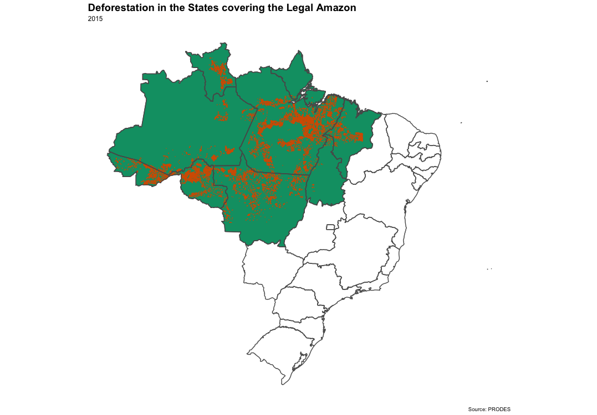

# Amazon Deforestation

Maps of deforestation in states covering the Amazon forest using the sf package in R

## Map for 2015 

## Data

Brazil Shapefiles: https://www.arcgis.com/home/item.html?id=1e45bf47c2f542cda9d507ce38ba354a 

PRODES Deforestation Data(spatial data on deforestation in the Amazon from 1998-2015): http://data.globalforestwatch.org/datasets/4160f715e12d46a98c989bdbe7e5f4d6_1 

Note: The data files are not directly included in the repository given that they exceed the size allowed by GitHub
